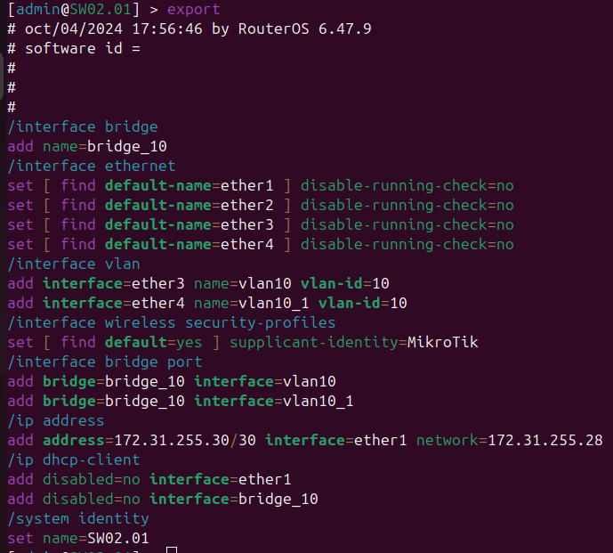
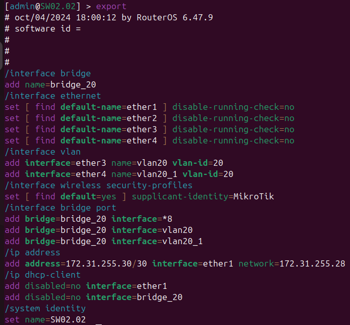
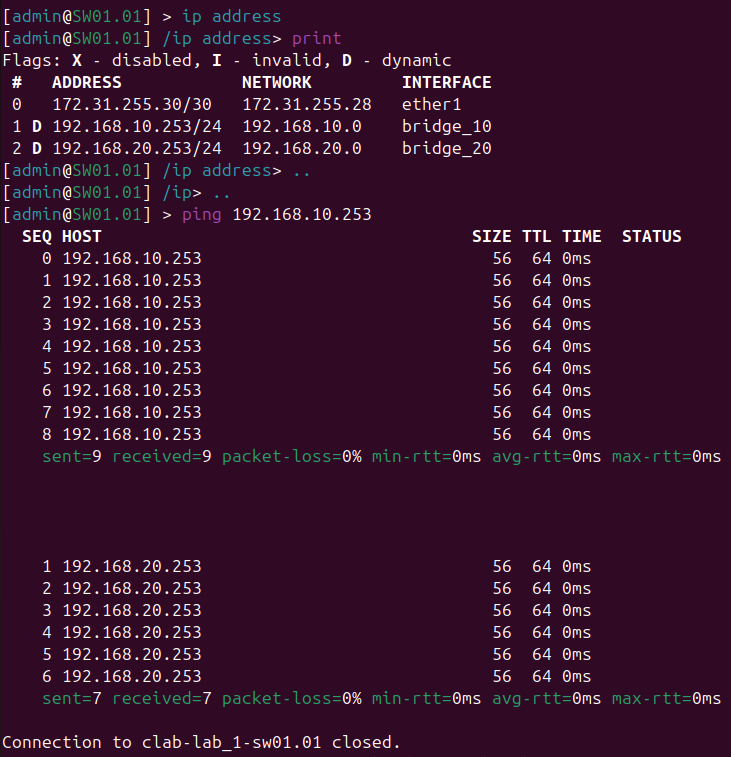
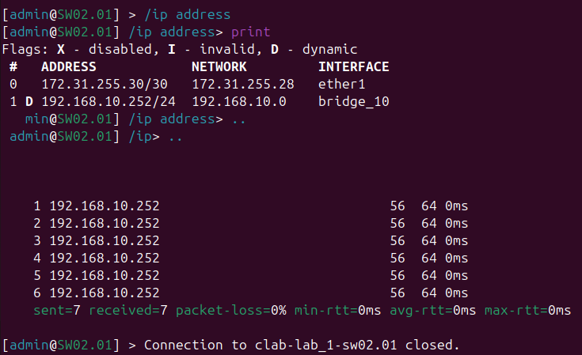
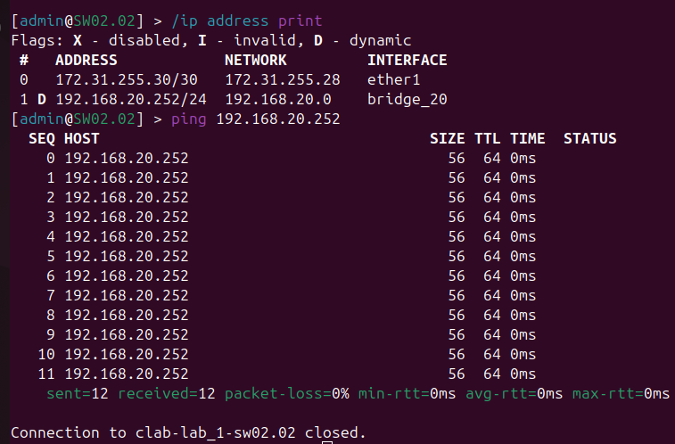

University: [ITMO University](https://itmo.ru/ru/)

Faculty: [FICT](https://fict.itmo.ru)

Course: [Introduction in routing](https://github.com/itmo-ict-faculty/introduction-in-routing)

Year: 2024/2025

Group: K3320

Author: Bakhtina Anastasia Viacheslavovna

Lab: Lab1

Date of create: 04.10.2024

Date of finished: 09.10.2024

# Отчёт по лабораторной работе №1 "Установка ContainerLab и развертывание тестовой сети связи"

***Цель:***  Ознакомиться с инструментом ContainerLab и методами работы с ним, изучить работу VLAN, IP адресации и т.д.

## Ход работы

В начале лабораторной работы №1 была построена следующая трехуровневая сеть связи классического предприятия:

Затем при попытке сделать данную лабораторную работу в виртуальной машине (Ubuntu) были замечены сложности с развертыванием контейнера и подключением к устройствам. На ноутбук был установлен Linux второй ОС. После таких манипуляций все было реализовано успешно.

В yaml-файле была задана топология сети, указанная на схеме:

## Конфигурация

### После задания конфигураций нод, проверим работоспособность:

###  Вывод

В данной лабораторной работе №1 была построена трехуровневая сеть классического предприятия. А также в ходе работы была ознакомлена с инструментом ContainerLab и методами работы с ним, была изучена работа VLAN, IP адресации.
