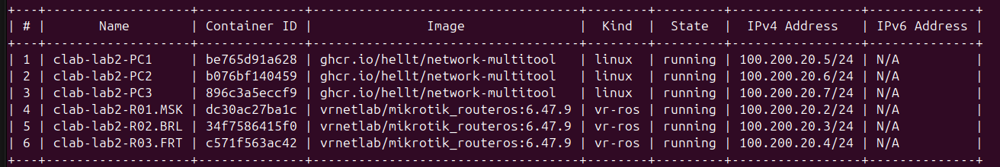

University: [ITMO University](https://itmo.ru/ru/)

Faculty: [FICT](https://fict.itmo.ru)

Course: [Introduction in routing](https://github.com/itmo-ict-faculty/introduction-in-routing)

Year: 2024/2025

Group: K3320

Author: Bakhtina Anastasia Viacheslavovna

Lab: Lab2

Date of create: 11.10.2024

Date of finished: 16.10.2024

# Отчёт по лабораторной работе №2 "Эмуляция распределенной корпоративной сети связи, настройка статической маршрутизации между филиалами"

***Цель:*** Ознакомиться с принципами планирования IP адресов, настройке статической маршрутизации и сетевыми функциями устройств.

## Ход работы

### Схема работы: 

В начале лабораторной работы №2 была построена следующая схема сети связи в трех геораспределенных офисах "RogaIKopita Games". Были созданы все устройства указанные на схеме и соединения между ними.

В yaml-файле была задана топология сети, указанная на схеме:

## Конфигурация
#### R01.MSK

#### R02.BRL

#### R03.FRT

## Таблицы маршрутизации:
#### R01.MSK

#### R02.BRL

#### R03.FRT

## Проверка работоспособности:

###  Вывод

В данной лабораторной работе №2 была построена схема сети связи в трех геораспределенных офисах "RogaIKopita Games". Я ознакомилась с принципами планирования IP адресов, научилась настройке статической маршрутизации и сетевыми функциями устройств.
