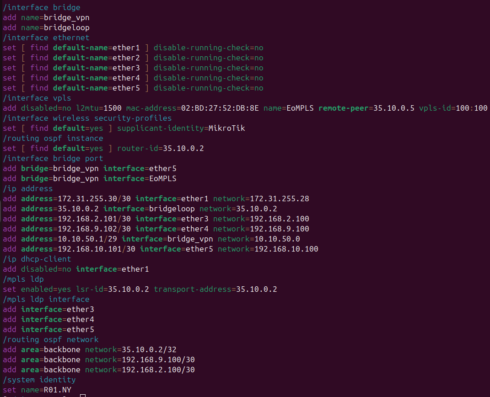
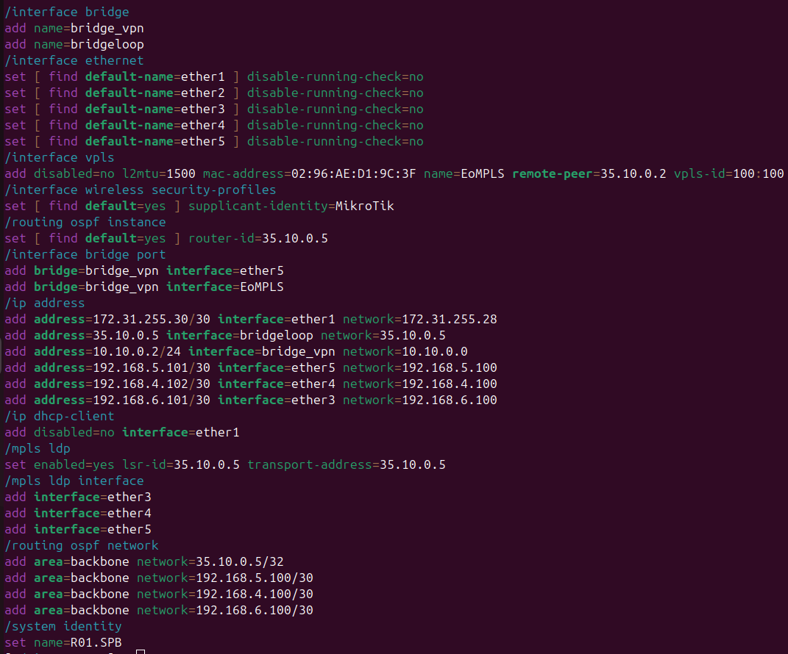
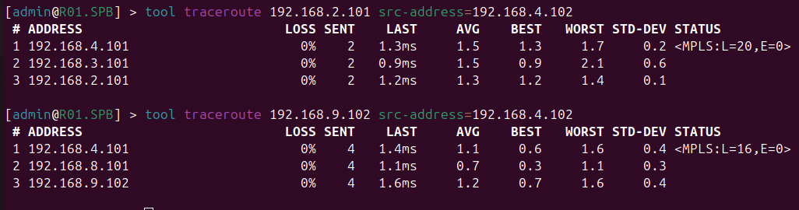

University: [ITMO University](https://itmo.ru/ru/)

Faculty: [FICT](https://fict.itmo.ru)

Course: [Introduction in routing](https://github.com/itmo-ict-faculty/introduction-in-routing)

Year: 2024/2025

Group: K3320

Author: Bakhtina Anastasia Viacheslavovna

Lab: Lab3

Date of create: 05.11.2024

Date of finished: 05.11.2024

# Отчёт по лабораторной работе №3 "Эмуляция распределенной корпоративной сети связи, настройка OSPF и MPLS, организация первого EoMPLS"

 ***Цель:*** Изучить протоколы OSPF и MPLS, механизмы организации EoMPLS.

## Ход работы

### Схема работы: 

В начале лабораторной работы №3 была построена следующая схема IP/MPLS сети связи для "RogaIKopita Games". Были созданы все устройства указанные на схеме и соединения между ними.

В yaml-файле была задана топология сети, указанная на схеме:

## Конфигурация
#### R01.NY

#### R01.LND

#### R01.HKI

#### R01.SPB

#### R01.MSK

#### R01.LBN

### RO1.NY:

### RO1.LND:

### RO1.HKI:

### RO1.SPB:

### RO1.MSK:

### RO1.LBN:

## Проверка работоспособности (PC1 -> SGI_PRISM, SGI_PRISM -> PC1):

##  Трассировка между роутерами

#### R01.SPB -> R01.NY

#### R01.NY -> R01.SPB

###  Вывод

В данной лабораторной работе №3 была построена схема сети связи для "RogaIKopita Games". А также были изучены протоколы OSPF и MPLS, механизмы организации EoMPLS.
