University: [ITMO University](https://itmo.ru/ru/)

Faculty: [FICT](https://fict.itmo.ru)

Course: [Introduction in routing](https://github.com/itmo-ict-faculty/introduction-in-routing)

Year: 2024/2025

Group: K3320

Author: Bakhtina Anastasia Viacheslavovna

Lab: Lab4

Date of create: 23.12.2024

Date of finished: 26.12.2024

# Отчёт по лабораторной работе №4 "Эмуляция распределенной корпоративной сети связи, настройка iBGP, организация L3VPN, VPLS"

 ***Цель:*** Изучить протоколы BGP, MPLS и правила организации L3VPN и VPLS.
 

 ## Ход работы

### Схема работы: 
В начале лабораторной работы №4 была построена следующая схема IP/MPLS сети связи для "RogaIKopita Games". Были созданы все устройства указанные на схеме и соединения между ними.

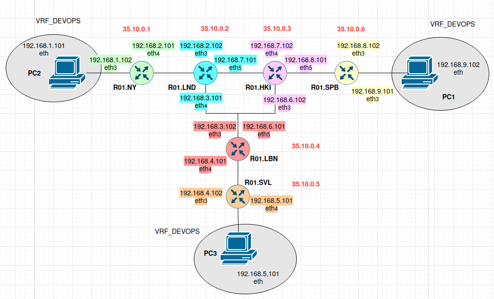

В yaml-файле была задана топология сети, указанная на схеме:

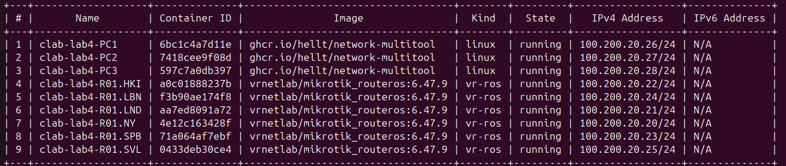

## Конфигурация
#### R01.NY
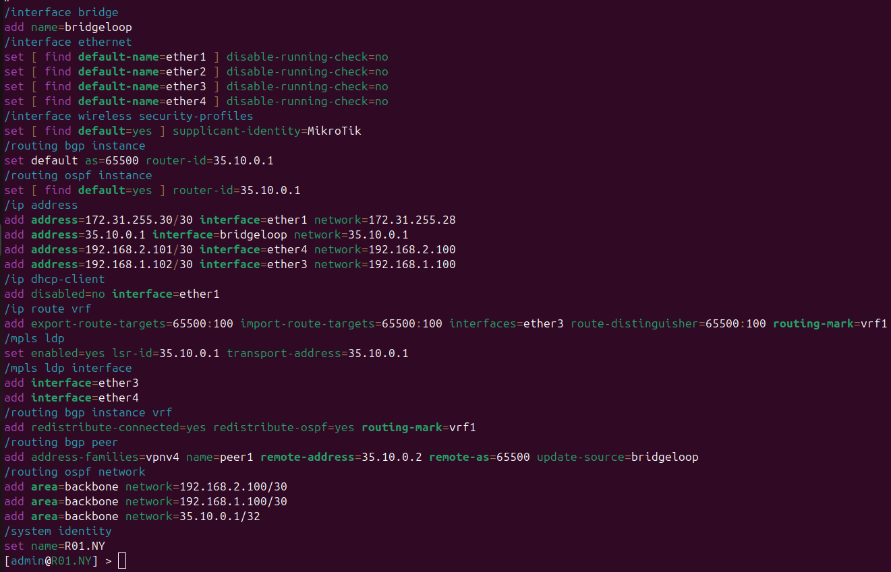

#### R01.LND
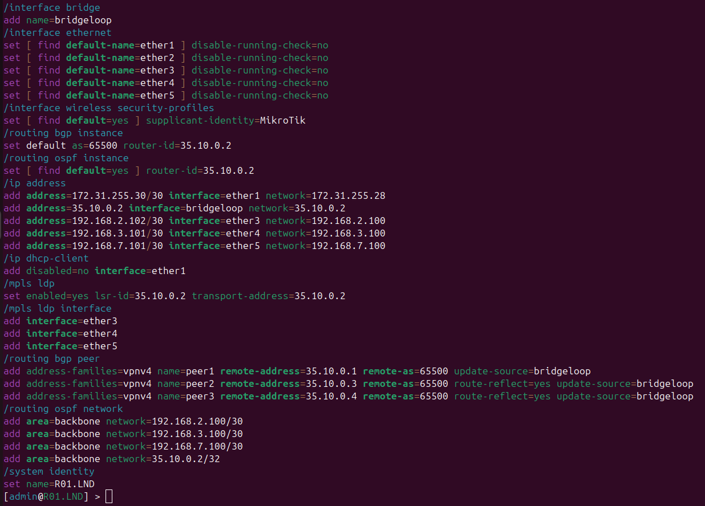

#### R01.HKI
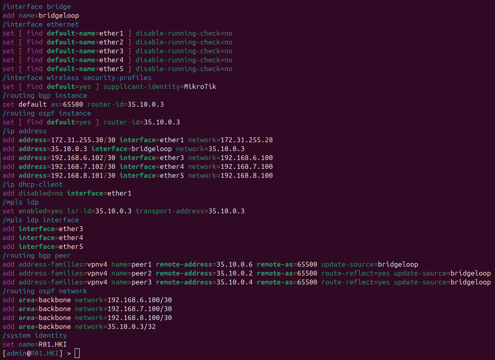

#### R01.SVL
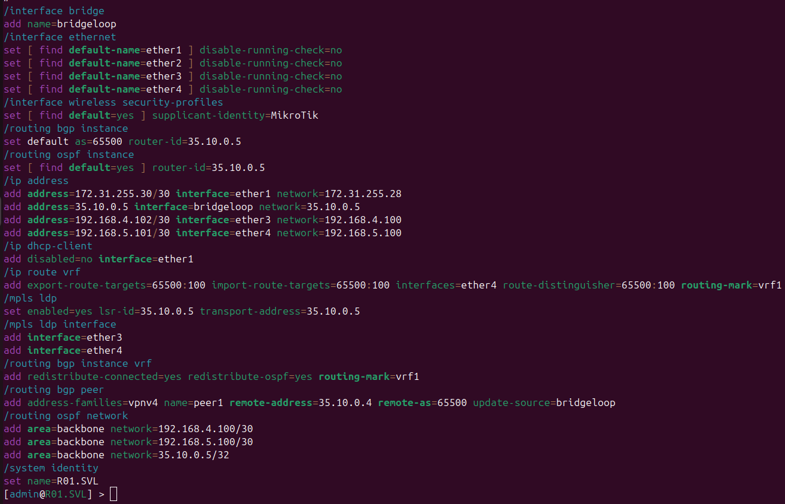

#### R01.LBN

## Часть 1
### PING: R01.NY -> R01.SPB, R01.SVL:
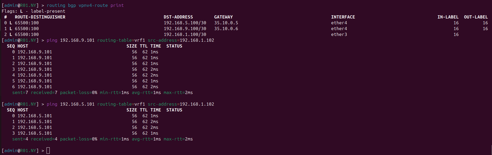

### PING: R01.SPB -> R01.NY, R01.SVL:
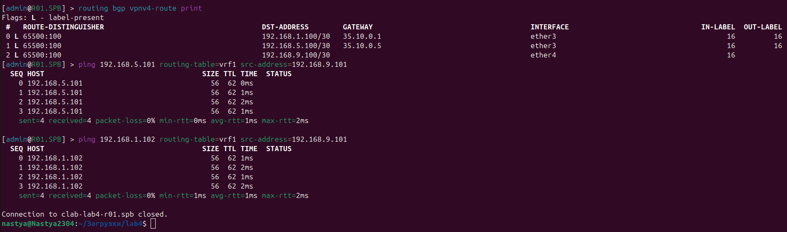

### PING: R01.SVL -> R01.SPB, R01.NY:
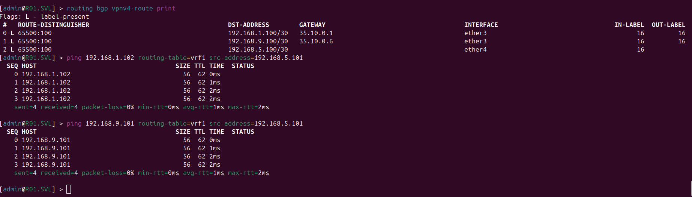

## Часть 2
### PING: PC1 -> PC2, PC3:
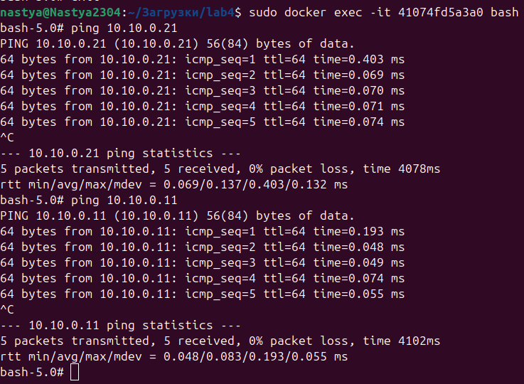

### PING: PC2 -> PC1, PC3:
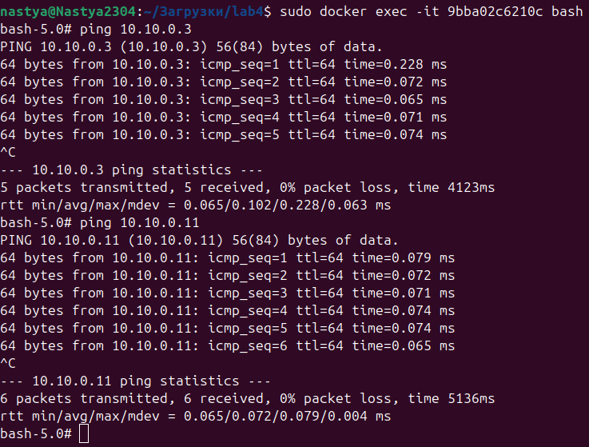

### PING: PC3 -> PC1, PC2:
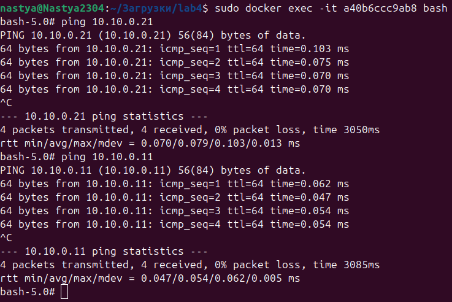

###  Вывод

В данной лабораторной работе №4 была построена схема сети связи для "RogaIKopita Games". А также были изучены протоколы BGP, MPLS и правила организации L3VPN и VPLS.
